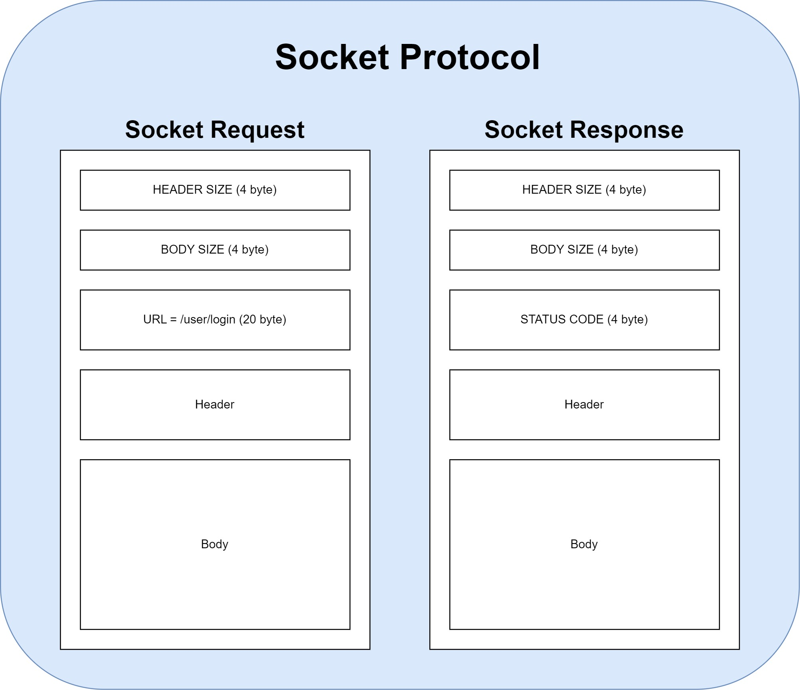

# 파일다잇소

> 소켓 프로그래밍을 이용해 유저끼리 파일 공유하는 P2P 애플리케이션

## 프로토콜 정의



## URL API 설계

```
URL : /user/login

Request Body : RequestLoginDto
{
  "email" : "hi@naver.com",
  "password" : "1234"
}
```

```
URL : /user/logout

Request Body : null
```

```
URL : /user/join 

Request Body :  RequestJoinDto
{
  "email" : "hi@naver.com",
  "password" : "1234"
}
```

```
URL : /user/delete

Request Body : null
```

```
URL : /file/upload

Request Body : stream data(binary data)
```

```
URL : /file/download

Request Body : null
```

```
URL : /file/metadata/create

Request Body : RequestCreateFileMetadataDto
{
  "userId" : 100,
  "subject" : "오펜하이머(번역)",
  "description" : "최신 영화 오펜하이머 번역본 고화질, 믿고 다운받으세요",
  "price" : 3000,
  "fileName" : "Oppenheimer.mp4",
  "size" : 1024
}
```

```
URL : /file/metadata/search/all

Request Body : RequestSearchAllDto
{
  "offset" : 0,
  "size" : 10
}
```

```
URL : /file/metadata/search/user

Request Body : RequestSearchFromUserDto
{
  "userId" : 13,
  "offset" : 10
}
```

```
URL : /file/metadata/search/subject

Request Body : RequestSearchFromSubjectDto
{
  "subject" : "영화",
  "offset" : 0
}
```

```
URL : /file/metadata/update

Request Body : RequestUpdateFileMetadataDto
{
  "userId" : 13,
  "requiredFileId" : 100,
  "price" : null,
  "subject" : "오펜하이머(수정본)",
  "description" : "기존 오펜하이머 동영상의 화질 개선"
}
```

```
URL : /file/metadata/delete

Request Body : RequestDeleteFileMetadataDto
{
  "userId" : 15,
  "fileId" : 100
}
```

```
URL : /payment/file/purchase

Request Body : RequestPurchaseFileDto
{
  "userId" : 13,
  "fileId" : 100
}
```

```
URL : /payment/authority/purchase

Request Body : RequestPurchaseAuthorityDto
{
  "userId" : 13,
  "role" : GENERAL
}
```

```
URL : /payment/point/charging

Request Body : RequestChargePointDto
{
  "userId" : 13,
  "addingPoints" : 1000
}
```


## 클래스 다이어그램

### 1. 서버측


### 2. 클라이언트측


프로젝트 커밋 메시지 카테고리
-----------------------------------------
> - [INIT] — repository를 생성하고 최초에 파일을 업로드 할 때
> - [ADD] — 신규 파일 추가
> - [UPDATE] — 코드 변경이 일어날때
> - [REFACTOR] — 코드를 리팩토링 했을때
> - [FIX] — 잘못된 링크 정보 변경, 필요한 모듈 추가 및 삭제
> - [REMOVE] — 파일 제거
> - [STYLE] — 디자인 관련 변경사항